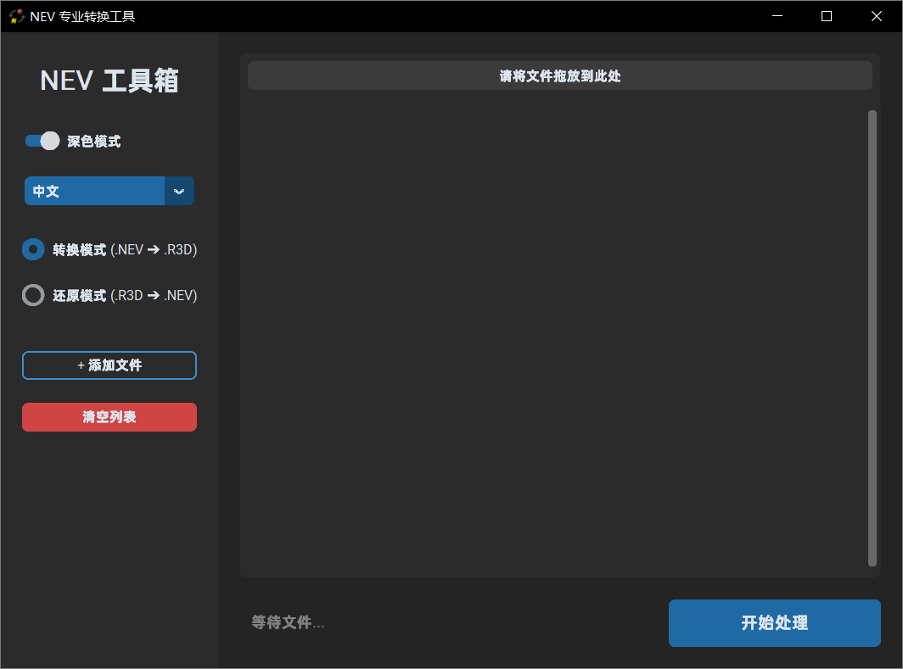
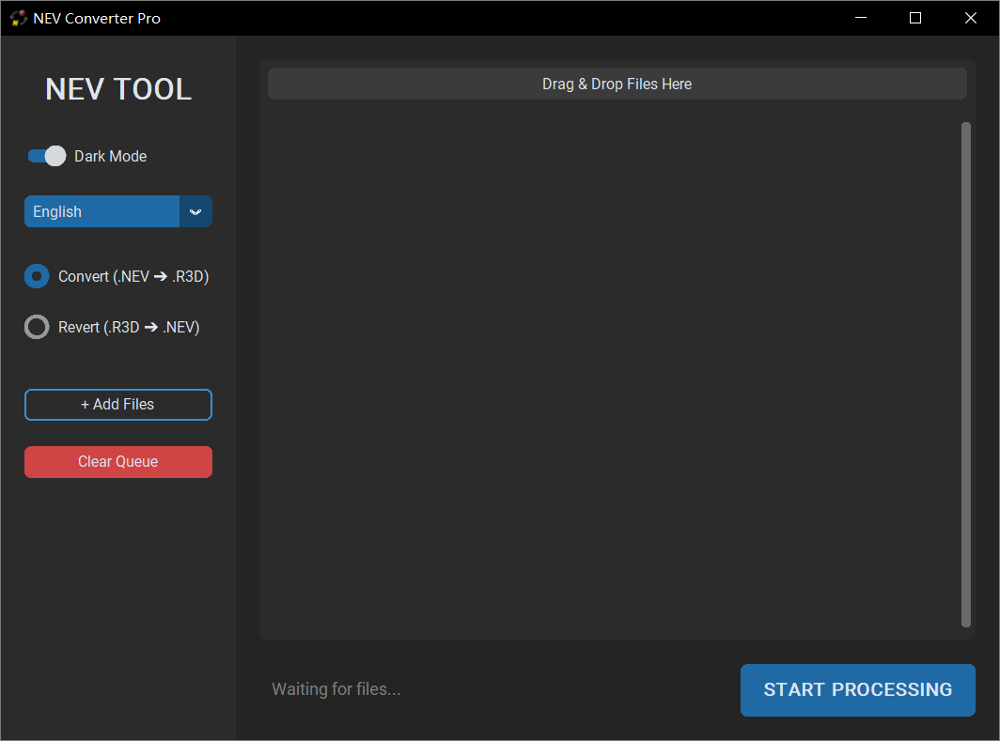

# 🎬 NEV Converter Pro (Nikon NRAW Tool)

**简体中文 &nbsp; | &nbsp; [English](#english)**

### 项目简介

本工具是一款专为 **尼康 NRAW (.NEV)** 视频素材设计的实用程序，旨在打通 NRAW 素材与专业后期制作流程之间的壁垒。

**核心原理：**
本软件通过执行精确的**二进制文件头修改**，将文件内部的 FourCC 编码标识符 `iNRAW` (Hex: `69 4E 52 41 57`) 替换为 `iNR3D` (Hex: `69 4E 52 33 44`)。这一操作可欺骗非编软件（如 DaVinci Resolve 或 REDCINE-X），使其将素材识别为 **R3D NE 媒体**，从而解锁 RED IPP2 流程及色彩科学。

**系统要求：**

* 您的剪辑软件或后期工具必须调用 **RED R3D SDK v9.0.1 或更高版本** 才能正确读取修改后的文件。

### ⚠️ 兼容性与支持机型

本方法适用于支持 **Nikon NRAW (.NEV)** 录制的机型，包括但不限于：

* **Nikon Z9, Z8, Z6III, Z5II, ZR** 以及其他支持该格式的机型。

**关于 Nikon ZR 的特别说明：**
Nikon ZR 相机支持录制两种 RAW 格式：**NRAW NEV** 和 **R3D NE**（后缀为 .R3D）。

* **本工具仅适用于 NRAW NEV 格式文件。**
* 本工具**不适用于** Nikon ZR 直接拍摄的 R3D 文件，也不适用于 RED 电影机的原生 R3D 文件。

**固件与更新警告：**

* **旧版固件：** 使用 Z9, Z8, Z6III 等机型的早期或旧版固件拍摄的素材可能会出现兼容性问题。
* **未来兼容性：** 请注意，本工具依赖于特定的文件结构。如果尼康在未来的固件更新中更改了文件格式，或 RED 更新了 R3D SDK 协议，本工具可能会失效。

### 📝 技术解析：R3D NE 与 标准 R3D

虽然 **R3D NE** (Nikon Edition) 与 **标准 R3D** (RED Native) 共享相同的封装容器，但它们在编码上有所不同：

* **R3D NE:** 专为 Nikon ZR 开发的 RAW 视频格式，是尼康基于 RED 编码技术适配其影像系统的产物。
* **标准 R3D:** 通常指 RED 电影机原生的高保真 RAW 格式，广泛应用于专业电影制作。
* *本工具的作用本质上是将 NRAW 数据重新标记，使其通过 R3D NE 解码路径进行处理。*

### 安装与使用

#### 方法 1: 使用独立 EXE 程序 (Windows)

在 Release 页面下载最新版本的 `.exe` 文件，直接运行即可，无需安装 Python 环境。

#### 方法 2: 源码运行

1. 确保已安装 Python 3.10 或更高版本。
2. 安装依赖库： `pip install customtkinter tkinterdnd2`
3. 运行脚本： `python NEV_Converter_Pro.py`

---
**[简体中文](#chinese) &nbsp; | &nbsp; English**

### Overview

This utility is a specialized tool designed to bridge the gap between **Nikon NRAW (.NEV)** footage and professional post-production workflows.

**Core Mechanism:**
This software performs a precise **binary header modification**. By targeting the internal FourCC codec identifier `iNRAW` (Hex: `69 4E 52 41 57`) and replacing it with `iNR3D` (Hex: `69 4E 52 33 44`), it "tricks" non-linear editing software (such as DaVinci Resolve or REDCINE-X) into recognizing the footage as **R3D NE media**. This unlocks access to the RED IPP2 workflow and color science for compatible Nikon footage.

**System Requirements:**

* To successfully read the patched files, your NLE or processing software must utilize **RED R3D SDK v9.0.1 or later**.

### ⚠️ Compatibility & Supported Models

This method is applicable to **Nikon NRAW (.NEV)** files recorded on models supporting this format, including but not limited to:

* **Nikon Z9, Z8, Z6III, Z5II, ZR**

**Important Notes on Nikon ZR:**
The Nikon ZR camera is capable of recording in two RAW formats: **NRAW NEV** and **R3D NE** (saved as `.R3D`).

* **This tool is ONLY for NRAW NEV files.**
* It is **NOT** needed (and ineffective) for native R3D files shot on the Nikon ZR or RED Cinema cameras.

**Firmware & Updates Warning:**

* **Legacy Firmware:** Footage shot with early or outdated firmware versions on models like the Z9, Z8, or Z6III may encounter compatibility issues.
* **Future Compatibility:** Please be aware that this tool relies on specific file structures. It may become ineffective if Nikon significantly alters the file format in future firmware updates or if RED modifies the R3D SDK protocols.

### 📝 Technical Distinction: R3D NE vs. Standard R3D

While **R3D NE** (Nikon Edition) and **Standard R3D** (RED Native) share the same container structure, they are distinct formats:

* **R3D NE:** A RAW video format developed specifically for Nikon ZR, adapted from RED's encoding technology for Nikon's imaging pipeline.
* **Standard R3D:** The high-fidelity RAW format natively used in professional RED film production.
* *This tool essentially re-flags NRAW data to be interpreted via the R3D NE decoder path.*

### Installation & Usage

#### Option 1: Standalone EXE (Windows)

Download the latest release, place the executable in a folder, and run it. No Python installation is required.

#### Option 2: Running from Source

1. Install Python 3.10+.
2. Install dependencies: `pip install customtkinter tkinterdnd2`
3. Run the script: `python NEV_Converter_Pro.py`

---

### Disclaimer / 免责声明

Use this software at your own risk. Always backup your original footage before processing. The authors are not affiliated with Nikon Corporation or RED Digital Cinema.  
使用本软件需自担风险。在处理任何素材前，建议备份原始文件。本软件与尼康 (Nikon Corporation) 及 RED Digital Cinema 无任何官方关联。
